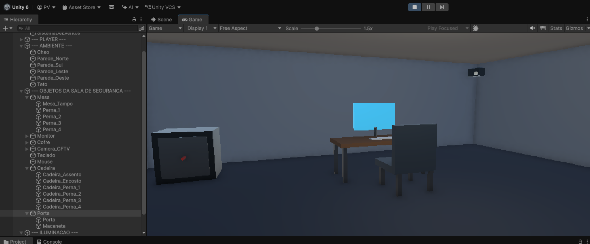

# Sala de Segurança VR

Projeto Final — Unidade 1 · Capítulo 3 · Web 3.0 (Residência em TIC 29)
Primeiro ambiente de Realidade Virtual em Unity.

## Conceito

Ambiente virtual simples e navegável que representa uma **sala de segurança**,
com mesa de monitoramento, monitor, cofre e uma câmera CFTV decorativa. O
usuário pode explorar a sala no Unity Editor usando teclado e mouse, sem a
necessidade de um headset VR.

## Versão do Unity

- **Unity 6000.3.19f1** — versão usada no desenvolvimento local do projeto.
- Render Pipeline: **URP (Universal Render Pipeline) 17.3.0**.

## Repositório

- GitHub: <https://github.com/duckrwx/cftv-metaverso>

## Evidência visual



## Pacotes usados

- Universal RP (URP)
- Input System (novo sistema de entrada — usado no controlador de PC)
- Módulos de XR (com.unity.modules.xr)
- TextMeshPro (incluso no template)

## Estrutura do projeto

```
Assets/
  Scripts/    PCPlayerController.cs      (navegação por teclado + mouse)
  Materials/  materiais URP da cena + skybox procedural
  Scenes/     SalaSegurancaVR.unity      (cena principal)
docs/         relatório técnico, link do repositório e imagem da cena
Packages/
ProjectSettings/
```

## Como abrir

1. Clonar o repositório.
2. Abrir o **Unity Hub** e adicionar a pasta do projeto.
3. Abrir com a versão **6000.3.19f1** (ou compatível).
4. Abrir a cena `Assets/Scenes/SalaSegurancaVR.unity`.

## Como testar

Pressione **Play** no Unity Editor e explore a sala:

| Tecla / Controle | Ação                    |
|------------------|-------------------------|
| W A S D          | Mover pela sala         |
| Mouse            | Olhar ao redor          |
| Espaço / Ctrl    | Subir / descer          |
| Shift            | Mover mais rápido       |
| ESC              | Liberar / travar cursor |

## Observações

O projeto foi pensado para execução **local no Editor**, com navegação por
teclado e mouse, pois não havia óculos/headset VR disponível para validação
direta. A configuração para Meta Quest (Build Android, XR Plugin Management e
Meta XR SDK) está descrita no relatório técnico que acompanha a entrega em
`docs/relatorio-tecnico.md`.

## Elementos da cena

Chão, quatro paredes, teto, mesa de monitoramento, monitor, cofre, câmera CFTV
decorativa, porta, teclado, mouse, cadeira, luz direcional e luz de teto —
todos com nomes em português e organizados em uma hierarquia com seções
nomeadas: GERENCIAMENTO, PLAYER, AMBIENTE, OBJETOS DA SALA DE SEGURANÇA e
ILUMINAÇÃO.

## Autor

Paulo Victor da Costa Vilarins — Web 3.0, Residência em TIC 29.
